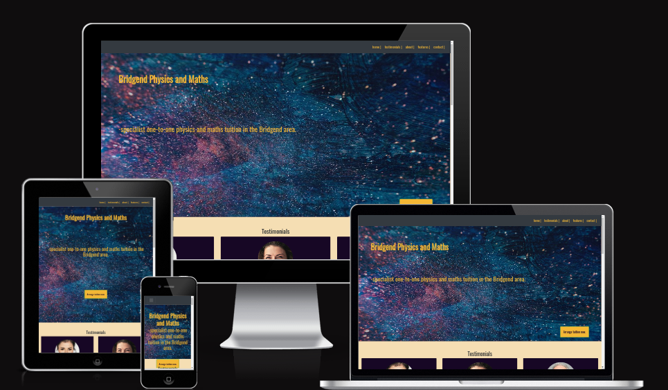
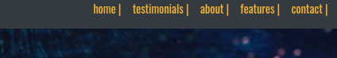
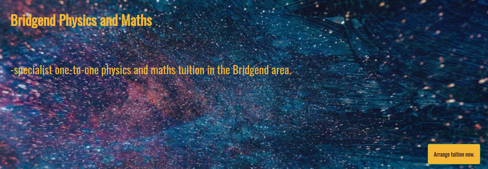
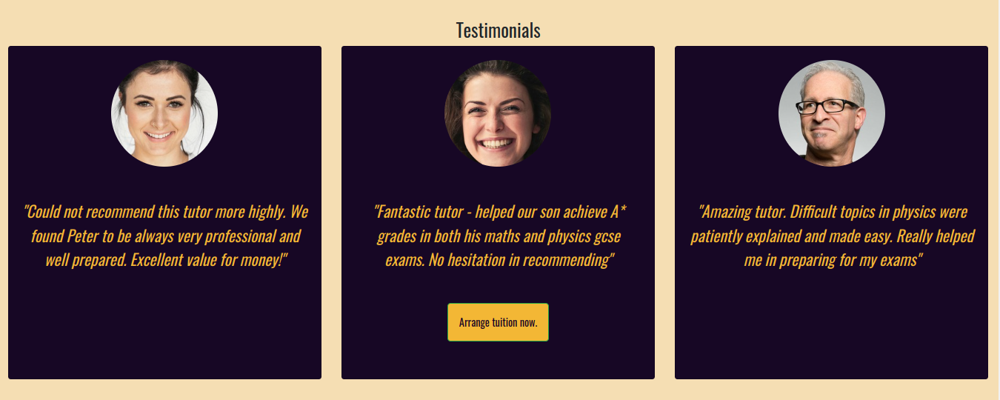
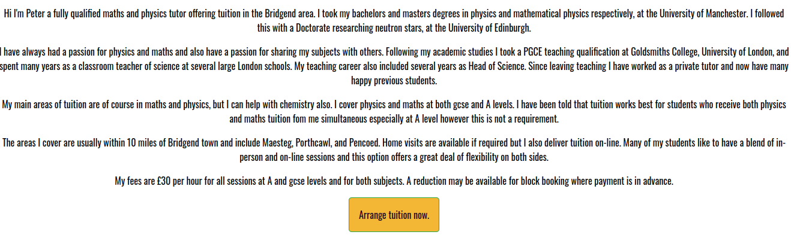
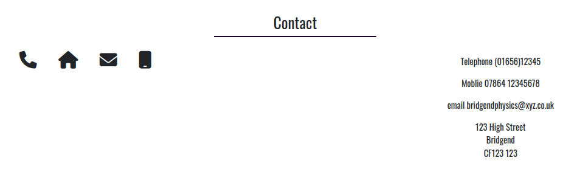
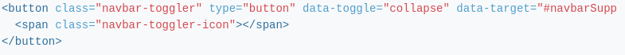

# **Bridgend Physics and Maths Website**  
 [Bridgend Physics and Maths website](https://doctorandrewbrown.github.io/bridgendphysics/).

This website has been developed for a fictional A level and GCSE physics and maths private tutor service. 

## UX Design

UX design was guided by the "five planes of UX" methodology. The five planes as they relate to the current project are detailed below.  

### Strategy

This project is considered worthwhile because an unmet demand for local private tutoring in physics and maths has been identified by the site-owner. Demand for such a service has been established by interviewing potential clients and researching competition in the targeted market. Site users are envisaged to be those seeking local in-person tuition in a given geographical location. This website will allow site users to find and contact a suitable local tutor (i.e. the site-owner) in order to arrange the tuition they need. The site is intended to provide value to both users and the site owner. Value is provided to users by assisting them to meet their tutoring needs, and to the site owner in terms of the business opportunity created by connecting with clients. 

To realize the above strategy, a custom personal website was chosen (instead of relying solely on social media for instance) as a website gives more flexibility and scope for branding the new service. A website can also be optimized for local SEO and building authority in the business niche by providing relevant content via a blog and articles. The website must be responsive to cater for the range of user devices that will be available to the intended users, especially mobile. A mockup of the responsive website can be seen here 

### Scope and User Stories

The scope for this project was restricted to what was needed for a MVP and is determined by considering tasks and information needed to serve the project strategy and to corellate with **user stories**. 

#### Tasks  

Users need to:

* Contact site owner to arrange tuition.

#### Information

Users need to:

* Find details of tutors qualifications and experience to assess suitabiity.
* Find information on location of service.
* Find details of subjects covered to assess suitabiity.
* View social proof of service ie. user testimonials to assess suitabiity.
* Find details of features of the service to assess suitabiity.
* Find information on fees.
* Find contact details.

Site owner needs to:
* Establish a web presence to showcase the services offered.

### Structure

Given the limited amount of content required to build the MVP, a single page website structure broken into sections was considered appropriate. Main navigation between sections is via a sticky navbar at the top of the page. Aditional cta buttons are included in the rendered web page to allow users to quickly reach contact details to complete conversion.

#### Features
Page sections with screen shots are described below.
* Main sticky navigation bar. This allows visitors to quicky move to any section wherever they are on the site.

  
  
* Testimonials - Social proof in the form of testimonials from happy clients was considered to be crucial content for this type of business. Therefore this section was placed near the page top.
  

* About - This section gives information on the qualifications and experience of the site-owner, geographical area covered and subjects offered 

* Key features - one-to-one, online, hybrid.  

* Contact details information.
  This section uses the design convention of icons to highlight features.

* The footer is included to follow structural convenventions, familiar to users.

  
### Skeleton

The skeleton plane of UX design was addressed using wireframe sketches. The wireframes express the interface design using concerns revealed above in the structure plane. The initial wireframes were changed after testing, to include more CTA buttons to improve conversion.

#### Wireframes

* [Desktop](https://github.com/doctorandrewbrown/bridgendphysics/blob/main/assets/wireframes/desk-top.jpg).

* [Phone](https://github.com/doctorandrewbrown/bridgendphysics/blob/main/assets/wireframes/phone.jpg).
*  [Tablet](https://github.com/doctorandrewbrown/bridgendphysics/blob/main/assets/wireframes/tablet.jpg).

### Surface
#### Colours
Colours were chosen to be conservative in nature to project a professional image and to give good contrast between different sections and also between background and text.

Colours used for text were
 `rgb(243, 183, 53)` and `rgb(0, 0, 0)`.
For section backgrounds the colours used were
`rgb(23, 3, 37)`, `rgb(255,255,255)` and
`rgb245,222,179`. For contrast and consistency, `rgb(243, 183, 53)` was also used for the cta buttons ensuring that the buttons were attractive and also consistent with the colour scheme.

#### Typography
In keeping with a professional image a sans-serif font was chosen for all text on the site. This was the [Oswald](https://fonts.googleapis.com/css2?family=Oswald&display=swap) font by google fonts.

[Fontawsome](https://fontawesome.com/v4/) icons were used in the contact and features section. These provide familiar and informative elements to users.

| Source | Location | Name| 
| --- | --- | --- |
| [Fontawsome](https://fontawesome.com/v4/icon/certificate) | features section | fa-certificate | |
| [Fontawsome](https://fontawesome.com/v4/icon/phone) | contact section | fa-phone|
| [Fontawsome](https://fontawesome.com/v4/icon/home) | contact section | fa-home | 
| [Fontawsome](https://fontawesome.com/v4/icon/envelope) | contact section | fa-envelope |    
| [Fontawsome](https://fontawesome.com/v4/icon/mobile) | contact section | fa-mobile |     

## Tecnnologies Used
- [HTML](https://en.wikipedia.org/wiki/HTML) used for the main site content.
- [CSS](https://en.wikipedia.org/wiki/CSS) used for the main site design and layout.
- [JavaScript](https://www.javascript.com) used for user interaction on the site via clickable buttons using javascript onclick method.

- [Git](https://git-scm.com) used for version control. (`git add`, `git commit`, `git push`)
- [GitHub](https://github.com) used for secure online code storage.
- [GitHub Pages](https://pages.github.com) used for hosting the deployed front-end site.
- [Gitpod](https://gitpod.io) used as a cloud-based IDE for development.
- [Bootstrap](https://getbootstrap.com) used as the front-end CSS framework for modern responsiveness and pre-built components.
-  [Tinypng](https://tinypng.com/) used for image file compression.
-  [Gimp](https://www.gimp.org/) used image manipulation.

-  [VScode](https://code.visualstudio.com/) used as development IDE.  
-  [JQuery](https://getbootstrap.com/docs/4.1/components/navbar/) used to implement Bootstrap hamburger menu. The relevant snippet is shown below;

  
  
             
## Testing

For all testing, please refer to the [TESTING.md](https://github.com/doctorandrewbrown/bridgendphysics/blob/main/TESTING.md) file.

## Deployment

The site was deployed to GitHub Pages. The steps to deploy are as follows:
- In the [GitHub repository](https://github.com/doctorandrewbrown/bridgendphysics), navigate to the Settings tab 
- From the source section drop-down menu, select the **Main** Branch, then click "Save".
- The page will be automatically refreshed with a detailed ribbon display to indicate the successful deployment.

The live link can be found [here](https://doctorandrewbrown.github.io/bridgendphysics)

### Local Deployment

This project can be cloned or forked in order to make a local copy on your own system.

#### Cloning

You can clone the repository by following these steps:

1. Go to the [GitHub repository](https://github.com/doctorandrewbrown/bridgendphysics) 
2. Locate the Code button above the list of files and click it 
3. Select if you prefer to clone using HTTPS, SSH, or GitHub CLI and click the copy button to copy the URL to your clipboard
4. Open Git Bash or Terminal
5. Change the current working directory to the one where you want the cloned directory
6. In your IDE Terminal, type the following command to clone my repository:
	- `git clone https://github.com/doctorandrewbrown/bridgendphysics.git`
7. Press Enter to create your local clone.

#### Forking

By forking the GitHub Repository, we make a copy of the original repository on our GitHub account to view and/or make changes without affecting the original owner's repository.
You can fork this repository by using the following steps:

1. Log in to GitHub and locate the [GitHub Repository](https://github.com/doctorandrewbrown/bridgendphysics)
2. At the top of the Repository (not top of page) just above the "Settings" Button on the menu, locate the "Fork" Button.
3. Once clicked, you should now have a copy of the original repository in your own GitHub account!

## Credits

### Content

| Source | Location | Notes |
| --- | --- | --- |
| [Markdown Builder](https://traveltimn.github.io/markdown-builder) | README.md and TESTING.md | tool to help generate the Markdown files |
| [Chris Beams](https://chris.beams.io/posts/git-commit) | version control | "How to Write a Git Commit Message" |
| [W3Schools](https://www.w3schools.com/bootstrap4/bootstrap_get_started.asp) | entire site | responsive boostrap |
| [W3Schools](https://www.w3schools.com/html/tryit.asp?filename=tryhtml_links_button_element) | cta buttons |  javascript snippet for button as a link |
| [Bootstrap ](https://getbootstrap.com/docs/4.5/components/navbar/) | navbar |  code snippets for navbar |
| [Bootstrap ](https://getbootstrap.com/docs/4.1/components/navbar/) | navbar |  code snippets for collapsing navbar in mobile |
| [Stackoverflow ](https://stackoverflow.com/questions/35868756/how-to-make-bootstrap-4-cards-the-same-height-in-card-columns) | bootstrap cards |  use of h-100 class for uniform height cards |
| [Stackoverflow ](https://stackoverflow.com/questions/6121725/favicon-ico-or-png-correct-tags) | favicon |  how to ad favicon link |

### Media

| Source | Location | Type | 
| --- | --- | --- | 
| [Pexels](https://www.pexels.com/photo/woman-in-collared-shirt-774909/) | testimonial section | image | 
| [Usplash](https://unsplash.com/photos/IF9TK5Uy-KI) | testimonial section | image | 
| [Pexels](https://www.pexels.com/photo/man-smiling-behind-wall-220453/) | testimonial section | image |
| [Pexels](https://images.pexels.com/photos/1629236/pexels-photo-1629236.jpeg?auto=compress&cs=tinysrgb&w=1260&h=750&dpr=1) | hero section | image | 
| [Favicon.io](https://favicon.io/favicon-generator/) | favicon | image | 

## Acknowledgements
- I would like to thank my Code Institute mentor, [Tim Nelson](https://github.com/TravelTimN) for their support throughout the development of this project.