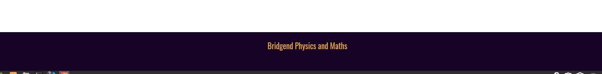

# **Bridgend Physics and Maths Website**  
https://doctorandrewbrown.github.io/bridgendphysics/

This website has been developed for a fictional A level and GCSE physics and maths private tutor service. 

## UX Design

UX design was guided by the "five planes of UX" methodology. The five planes as they relate to the current project are detailed below.  

### Strategy

This project is considered worthwhile because an unmet demand for local private tutoring in physics and maths has been identified by the site-owner. Demand for such a service has been established by interviewing potential clients and researching competition in the targeted market. Site users are envisaged to be those seeking local in-person tuition in a given geographical location. This website will allow site users to find and contact a suitable local tutor (i.e. the site-owner) in order to arrange the tuition they need. The site is intended to provide value to both users and the site owner. Value is provided to users by assisting them to meet their tutoring needs, and to the site owner in terms of the business opportunity created by connecting with clients. 

To realize the above strategy, a custom personal website was chosen (instead of relying solely on social media for instance) as a website gives more flexibility and scope for branding the new service. A website can also be optimized for local SEO and building authority in the business niche by providing relevant content via a blog and articles. The website must be responsive to cater for the range of user devices that will be available to the intended users, especially mobile. A mockup of the responsive website can be seen here 

### Scope

The scope for this project was restricted to what was needed for a MVP and is determined by considering tasks and information needed to serve the project strategy. 

#### Tasks  

Users need to:

* Contact site owner

#### Information

Users need to:

* Find details of tutors qualifications
* Find details of subjects covered 
* View social proof of service ie. user testimonials
* Find details of features of the service

Blogging functionality is not included in the scope at this (MVP) stage but could easily be added in future. Article pages (HTML) could easily be added to the MVP at a future date. In this way, the current MVP provides immediate value and potential for future extensibility to serve the business strategy. 

### Structure

Given the limited amount of content required to build the MVP, a single page website structure broken into sections was considered appropriate. Main navigation between sections is via a sticky navbar at the top of the page. Aditional cta buttons are included in the rendered web page to allow users to quickly reach contact details to complete conversion.

#### Features
Page sections with screen shots are described below.
* Main sticky navigation bar. This allows visitors to quicky move to any section wherever they are on the site.

* Header with CTA - This is a hero section announcing the business title and a tagline summing up the essentials of the service. This section also includes a CTA button linking to the contact details section. 
  
  
* Testimonials - Social proof in the form of testimonials from happy clients was considered to be crucial content for this type of business. Therefore this section was placed near the page top.
  
  
* About - This section gives information on the qualifications and experience of the site-owner, geographical area covered and subjects offered 
* Key features - one-to-one, online, hybrid. This section uses the design convention of icons to highlight features. 
* Contact details information.
  

* The footer is included to follow structural convenventions, familiar to users.

  
  
### Skeleton

The skeleton plane of UX design was addressed using wireframe sketches. The wireframes express the interface design using concerns revealed above in the structure plane. The initial wireframes were changed after initial testing to include more CTA buttons to improve conversion.

#### Wireframes

* [Desktop](https://github.com/doctorandrewbrown/bridgendphysics/blob/main/assets/wireframes/desk-top.jpg).

* [Phone](https://github.com/doctorandrewbrown/bridgendphysics/blob/main/assets/wireframes/phone.jpg).
*  [Tablet](https://github.com/doctorandrewbrown/bridgendphysics/blob/main/assets/wireframes/tablet.jpg).

### Surface
#### Colours
Colours were chosen to be conservative in nature to project a professional image and to give good contrast between different sections and also between background and text.

Colours used for text were
 rgb(243, 183, 53) and rgb(0, 0, 0).
For section backgrounds the colours used were
rgb(23, 3, 37) and rgb(255,255,255). For contrast and consistency, rgb(243, 183, 53) was again used for the cta buttons.

Colours for the cta button were rgb(23, 3, 37) and black. These choices ensured the buttons were attractive and also consistent with the colour scheme.

#### Typography
In keeping with a professional image a sans-serif font was chosen for all text on the site. This was the [Oswald](https://fonts.googleapis.com/css2?family=Oswald&display=swap) font by google fonts.

## Tecnnologies Used
- [HTML](https://en.wikipedia.org/wiki/HTML) used for the main site content.
- [CSS](https://en.wikipedia.org/wiki/CSS) used for the main site design and layout.
- [JavaScript](https://www.javascript.com) used for user interaction on the site via clickable buttons.

- [Git](https://git-scm.com) used for version control. (`git add`, `git commit`, `git push`)
- [GitHub](https://github.com) used for secure online code storage.
- [GitHub Pages](https://pages.github.com) used for hosting the deployed front-end site.
- [Gitpod](https://gitpod.io) used as a cloud-based IDE for development.
- [Bootstrap](https://getbootstrap.com) used as the front-end CSS framework for modern responsiveness and pre-built components.
  
## Testing

For all testing, please refer to the [TESTING.md](TESTING.md) file.

## **Bugs**

* Text overflow was encountered with the h1 and h2 headings in the hero section, when initial testing for small devices. This was due to the above elements not being placed in their own columns. Placing the h1, h2 elements (and cta button) in their own columns allowed responsivity. Solving this bug demonstrated the importance of following bootstrap format to get built-in responsiveness.

* The initial web-page layout used a single bootstrap container-fluid for the whole page. This caused an issue with the contact section which was required to be full-width. The bug was that bootstrap applied unwanted right and left margins. The bug was solved by enclosing the contact section in it's own container-fluid. 

* The rendered site showed streching of some images. This was solved by targeting the css rule object-fit:cover to the relevant img tags.
## **Testing**

Testing was conducted throughout development. Incremental changes were tested by opening the partly complete site in the chrome browser and "eye-balling" results. Incremental changes were initially tested for responsiveness via chrome inspector dev tools. The chrome inspector was also used to identify layout problems and testing small style changes before amending code. 

Performance testing of the deployed site was via Google Lighthouse. This identified dependencies that were affecting load times. One such dependency was a minified fontawsome.css file I had initially included in my local directory. This
was replaced by using a modern fontawsome kit approach instead, bringing a small improvement in load speed.
Lighthouse testing also flagged large image sizes slowing load time.

HTML and CSS checking used respectively, validator.w3.org and jigsaw.w3.org.

The HTML test tool flagged two instaces of the h1 element in my code where one is recommended for a single article (ie the web page). This was corrected in the final code. A missing DOCTYPE tag was also flagged and this was added to comply with current practice.

Browser testing was conducted in Chrome and Firefox. Responsivity was tested for a range of device sizes ie small, medium and large in both browsers. For testing small and medium devices, the iPhone SE and the iPad mini were selected. Large device testing was via a physical laptop.

## **Deployment**

# Deployment

The site was deployed to GitHub Pages. The steps to deploy are as follows:
- In the [GitHub repository](https://github.com/doctorandrewbrown/bridgendphysics), navigate to the Settings tab 
- From the source section drop-down menu, select the **Main** Branch, then click "Save".
- The page will be automatically refreshed with a detailed ribbon display to indicate the successful deployment.

The live link can be found [here](https://doctorandrewbrown.github.io/bridgendphysics)

### Local Deployment

This project can be cloned or forked in order to make a local copy on your own system.

#### Cloning

You can clone the repository by following these steps:

1. Go to the [GitHub repository](https://github.com/doctorandrewbrown/bridgendphysics) 
2. Locate the Code button above the list of files and click it 
3. Select if you prefer to clone using HTTPS, SSH, or GitHub CLI and click the copy button to copy the URL to your clipboard
4. Open Git Bash or Terminal
5. Change the current working directory to the one where you want the cloned directory
6. In your IDE Terminal, type the following command to clone my repository:
	- `git clone https://github.com/doctorandrewbrown/bridgendphysics.git`
7. Press Enter to create your local clone.

#### Forking

By forking the GitHub Repository, we make a copy of the original repository on our GitHub account to view and/or make changes without affecting the original owner's repository.
You can fork this repository by using the following steps:

1. Log in to GitHub and locate the [GitHub Repository](https://github.com/doctorandrewbrown/bridgendphysics)
2. At the top of the Repository (not top of page) just above the "Settings" Button on the menu, locate the "Fork" Button.
3. Once clicked, you should now have a copy of the original repository in your own GitHub account!

## **Credits**

* Pexels and Shutterstock for free stock images

* Tinyjpg for image compression

* w3schools for html css reference
* Stackoverflow for general guidance
