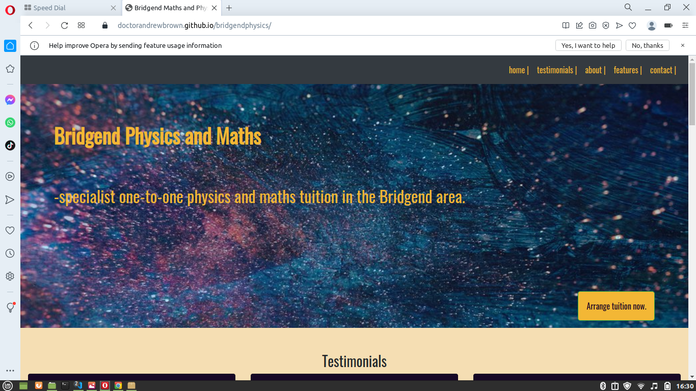
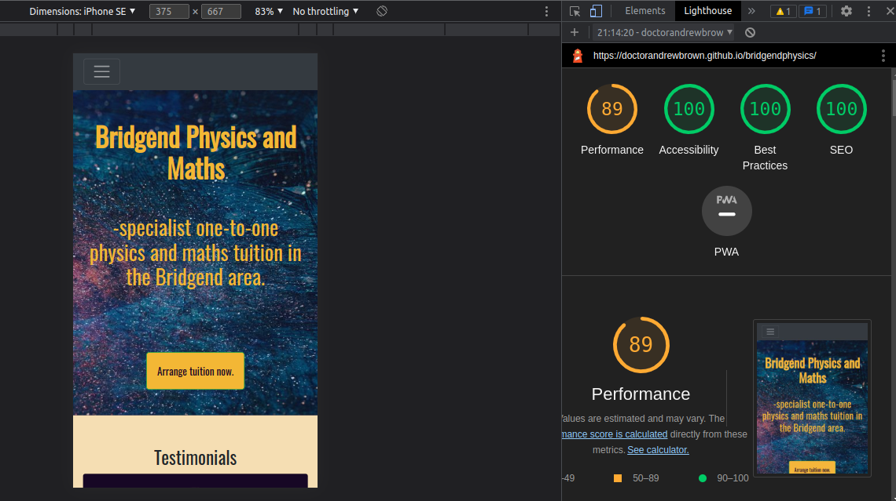

# Testing
## HTML
Back to [README.md](https://github.com/doctorandrewbrown/bridgendphysics/blob/main/README.md) file.

HTML on the live deployed site was validated at [w3.validator](https://validator.w3.org/#validate_by_uri) and the result is shown [here](https://validator.w3.org/nu/?doc=https%3A%2F%2Fdoctorandrewbrown.github.io%2Fbridgendphysics%2F)

During development he HTML test tool flagged two instances of the h1 element in my code where one is recommended for a single article (ie the web page). This was corrected in the final code. A missing DOCTYPE tag was also flagged and this was added to comply with current practice.

## CSS
I have used the recommended [CSS Jigsaw Validator](https://jigsaw.w3.org/css-validator) to validate my CSS files on the live deployed site and the result is shown [here](https://jigsaw.w3.org/css-validator/validator?uri=https%3A%2F%2Fdoctorandrewbrown.github.io%2Fbridgendphysics%2F&profile=css3svg&usermedium=all&warning=1&vextwarning=&lang=en)

## Browser Compatibility

Recommended browsers to consider:
- [Chrome](https://www.google.com/chrome)
- [Firefox](https://www.mozilla.org/firefox/developer)
- [Opera](https://www.opera.com/download)

I've tested my deployed project on several browsers to check for compatibility issues.

| Browser | Screenshot | Notes |
| --- | --- | --- |
| Chrome |  | Works as expected |
| Firefox |  | Works as expected |
| Opera |  | Works as expected |

## Responsiveness

| Device | Screenshot | Notes |
| --- | --- | --- |
| Mobile (DevTools) |  | Works as expected |
| Tablet (DevTools) |  | Works as expected |
| Laptop |  | Works as expected |

## User Story Testing
Users need to:

* Find details of tutors qualifications and experience to assess suitability.
* Find information on location of service.
* Find details of subjects covered to assess suitability.
* View social proof of service ie. user testimonials to assess suitability.
* Find details of features of the service to assess suitability.
* Find information on fees.
* Find contact details.

Site owner needs to:
* Establish a web presence to showcase the services offered.
  
| User Story | Screenshot |
| --- | --- |
| As a new site user, i need to know location of service.|  |
| As a new site user, I need to know subjects covered.|  |
| As a new site user, I would like to find details of tutors experience and qualifications so that I can assess their suitability|  |
| As a new site user I need to see social proof of quality.|  |
| As a new site user, I would like to find details of fees for the service|  |
| As a new site user, I would like to find contact details for the service|  |

### Site Owner
As the site owner I need to showcase my service and provide a way for new clients to find my contact details. This goal is satisfied by creating a site which has all the features needed to explain the service offered in the best light and in providing means to contact the business owner.

## Lighthouse Audit
I have tested my deployed site to check for any major issues.

| Size | Screenshot | Notes
| --- | --- | --- |
| mobile|  | Some warnings related to external external dependencies e.g. Bootstrap|
| laptop | | Minor warning about caching policy |

## Manual Testing
This involved testing of the site navigation. Site navigation was via a sticky top navbar with links to each page section and several cta buttons linking to the contact details section. Main navigation was tested to ensure the ability to move to and from any section via the sticky nav bar which was visible whatever section the user was on. The cta buttons were tested to ensure they link to the contact section.

## Bugs
### Known Remaining Bugs
There was an issue with the hamburger menu in the mobile view in that the dropdown menu shown on click obscured the screen until it was cleared by a second click.

 This would result in a poor user experience in the deployed site. This was discussed with my mentor but solving this issue was judged to be beyond current scope but would clearly need to be addressed in a real site.

### Solved Bugs
* Text overflow was encountered with the h1 and h2 headings in the hero section, when initial testing for small devices. This was due to the above elements not being placed in their own columns. Placing the h1, h2 elements (and cta button) in their own columns allowed responsiveness. Solving this bug demonstrated the importance of following bootstrap format to get built-in responsiveness.

* The initial web-page layout used a single bootstrap container-fluid for the whole page. This caused an issue with the contact section which was required to be full-width. The bug was that bootstrap applied unwanted right and left margins. The bug was solved by enclosing the contact section in it's own container-fluid. 

* The rendered site showed stretching of some images. This was solved by targeting the css rule object-fit:cover to the relevant img tags.

 There are no remaining bugs I am aware of.

